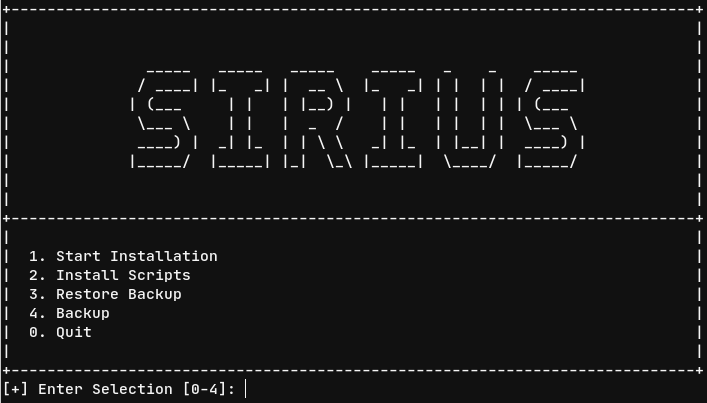

# Sirius - A Post System Installation Script

**Sirius** is a collection of my personal system configurations and applications that I use in my personal computer. It does automatic package installations and configuration that I used to do after a fresh Fedora installation.

## Table of Contents

[[_TOC_]]

## Screenshot



## What's included

- Apps:
   - [IBus Avro](https://gitlab.com/AlShakib/ibus-avro)
   - [Telegram Desktop](https://desktop.telegram.org/)
   - [Heroku CLI](https://devcenter.heroku.com/articles/heroku-cli)
   - [youtube-dl](https://youtube-dl.org)
   - [rclone](https://rclone.org)
   - [hugo extended](https://gohugo.io)
   - RPM Packages ([List Here](packages/dnf))
   - Flathub Packages ([List Here](packages/flathub))
   - NPM Packages ([List Here](packages/npm))
   - PIP Packages ([List Here](packages/pip))
- Gnome Shell extensions:
   - [Arc Menu](https://extensions.gnome.org/extension/1228/arc-menu)
   - [Dash to Panel](https://extensions.gnome.org/extension/1160/dash-to-panel)
   - [GSConnect](https://extensions.gnome.org/extension/1319/gsconnect)
   - [Internet Speed Meter](https://extensions.gnome.org/extension/2980/internet-speed-meter)
   - [OpenWeather](https://extensions.gnome.org/extension/750/openweather)
   - [Panel OSD](https://extensions.gnome.org/extension/708/panel-osd)
   - [Status Area Horizontal Spacing](https://extensions.gnome.org/extension/355/status-area-horizontal-spacing)
   - [system-monitor](https://extensions.gnome.org/extension/120/system-monitor)
   - [TopIcons Plus Git](https://extensions.gnome.org/extension/2311/topicons-plus)
   - [User Themes](https://extensions.gnome.org/extension/19/user-themes)
   - [Window Is Ready - Notification Remover](https://extensions.gnome.org/extension/1007/window-is-ready-notification-remover)
- Fonts:
   - Adorsho Lipi
   - Akaash
   - Arial
   - Arial Rounded
   - Bangla
   - Ben Sen
   - Calibri
   - Cambria
   - Century Gothic
   - Century Schoolbook
   - Comic Sans
   - Consolas
   - Courier New
   - Dancing Script
   - Garamond
   - Geogia
   - Google Sans
   - Jetbrains Mono
   - Josefin Sans
   - Joti One
   - Kalpurush
   - Lobster
   - Merriweather
   - Mitra
   - Monaco
   - Monaco B
   - Mukti
   - Nikosh
   - Nirmala
   - Pacifico
   - Poppins
   - Sagar
   - San Francisco Pro
   - Segoe UI
   - Siyam Rupali
   - Solaiman Lipi
   - Sutonny MJ
   - Tahoma
   - Times New Roman
   - Ubuntu Font
   - Verdana
   - And many more from RPM Packages ([List Here](packages/dnf))
- Themes:
   - [Plata Theme](https://gitlab.com/tista500/plata-theme)
- Wrapper scripts:
   - csync ([Read Here](csync.md))
   - ssdl ([Read Here](ssdl.md))
   - ytdl ([Read Here](ytdl.md))
- Backup and restore:
   - csync script configuration.
   - rclone configuration.
   - vnstat database.
- GSettings configurations ([List Here](config/gsettings))
- Disable grub menu (Since I have only one OS installed)
- Disable Wayland
- Android udev rules
- set /tmp size to 8GB
- Install Oh My ZSH
- Install zsh-autosuggestions
- vimrc configuration
- zshrc configuration
- And many more...

## Getting Started

To run this script, you will need

- Fedora 31 Workstation (x86_64)

### Running the script

Clone this repository

```bas
git clone https://gitlab.com/AlShakib/sirius.git
```

Change current directory to the repository

```bash
cd sirius
```

Run the script,

```bash
sudo ./start.sh
```

To setup gsettings settings - run,

```bash
./gsettings.sh
```

## Customization

There are few things you can customize before running the script.

### `home.edit` and `root.edit`

There are two files in the `config` directory named `home.edit` and `root.edit`. These two files contain the location of those files which are going to be edited by the script. The source file will contain in the `root` or the `home` directory. By reading those source files, the script will edit the destination file. By default the destination file has to contain the `variable = value` format. (Note the `=` delimiter.)

#### The `source` file

The source file may have following format:

- `entry=value` : If entry is already present in destination, override the value in the destination otherwise append the entry to the destination.
- `@entry|value` : Append new value to entry's value if present in destination.
- `$entry=value` : Change value if and only if entry exists.
- `!entry`: Remove entry from destination.
- `>entry `: Forcefully append to destination.
- `~entry` : Uncomment an entry from the destination file. (Only # comment is supported for now.)

### Add new file to system

- The `root` directory contains all files which are going to copy or override over `/` directory. You can add or modify any file in the `root` directory. You can skip from directly being copied by adding those files to `config/root.edit`. (Note: You should not add files to `root/home/{username}/`. The home directory requires ownership of the user. If you want to add files to the home directory, follow the next instruction.)
- The `home` directory contains all files which are going to copy or override over `/home/{username}/`. You can add or modify any file in the `home` directory. You can skip from directly being copied by adding those files to `config/home.edit`.

### Add new package to package list

You can add new package to package list by editing `packages/dnf`, `packages/flathub`, `packages/npm` and `packages/pip`.

#### Package list file

The package list file will contain the name of the packages. For example, if you add `tilix` to `packages/dnf`, the script will install Tilix Terminal Emulator.

You can remove a package by adding `!` in front of the package name. For example, if you add `!tilix` to `package/dnf`, the script will remove Tilix Terminal Emulator from system.

### Add new gnome shell extensions

You can add new gnome shell extensions to `root/usr/share/gnome-shell/extensions` for system level installation or `home/.local/share/gnome-shell/extensions` for user level installation.

### Add new fonts

You can add new fonts to `root/usr/share/fonts` for system level font installation.

### Add new themes

You can add new themes to `root/usr/share/themes` for system level theme installation.

### Add or modify gsettings value

You can add new gsettings value or modify existing gsettings value by editing `config/gsettings`.

### Logs

After running the script, the log file can be found in the `log` directory.

## Contributing

Pull requests are welcome. As it is my personal setup, I may or may not accept those requests. Feel free to fork this repository and modify.

## Thanks to

- Project Icon is made by [Eucalyp](https://www.flaticon.com/authors/eucalyp) from [www.flaticon.com](https://www.flaticon.com)

## License

[GNU General Public License v3.0](LICENSE)

Copyright © 2020 [Al Shakib](https://alshakib.dev)
